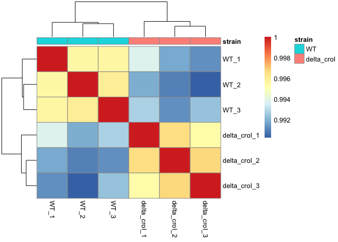
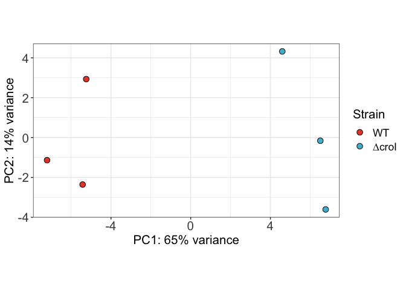
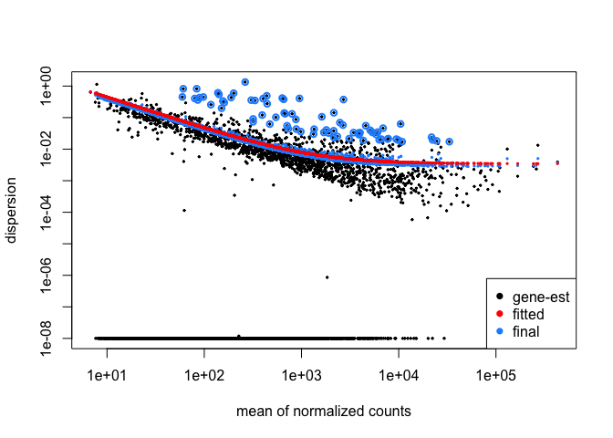

RNA-seq analysis - Differential Expression
================
Jorge Peña Díaz
2023-05-21

------------------------------------------------------------------------

Analysis used to compare the gene expression profile of the ∆*croI* and
wild-type (WT) *C. rodentium* DB1000 strains as published in:

> Peña‑Díaz, J., Woodward, S.E., Creus‑Cuadros, A., Serapio‑Palacios,
> A., Deng, W., and Finlay, B.B. (2023). Quorum Sensing Modulates
> Bacterial Virulence and Colonization Dynamics During an Enteric
> Infection. bioRxiv,
> [10.1101/2023.03.14.532656](https://www.biorxiv.org/content/10.1101/2023.03.14.532656v1).

------------------------------------------------------------------------

### 1. Setup

Load the required packages for the analysis.

``` r
library(tidyverse)
library(DESeq2)
library(pheatmap)
library(ggsci)
library(IHW)
library(ggrepel)
library(WGCNA)
#library(bbcRNA)
```

Load the required custom functions.

**Note:** Since the installation of the `bbcRNA` package is not
functioning, we’ll import the required `star_to_mat` as a custom
function.

``` r
source("scripts/star_to_mat.R")
source("scripts/make_bold_names.R")
```

### 2. Import the raw data and metadata

``` r
# Import raw data
data <- star_to_mat(dir = "data/ReadsPerGene/", rgx = "^[^-]+", column = 1) 
head(data)
```

    ##             delta_croI_1 delta_croI_2 delta_croI_3 WT_1 WT_2 WT_3
    ## ROD_RS00010           69           53           59   84   74   65
    ## ROD_RS00015         5182         2928         3692 4697 3711 3850
    ## ROD_RS00020         1288          744          849 1027  768  933
    ## ROD_RS00025         2733         1906         2272 2285 1976 2316
    ## ROD_RS00030         1050          772          974  915  817  968
    ## ROD_RS00035          180          133          168  183  154  174

``` r
# Import metadata
metadata <- read.csv("data/metadata.csv", row.names = "name") %>%
  mutate(strain = factor(strain, levels = c("WT", "delta_croI")),
         replicate = factor(replicate))

head(metadata)
```

    ##                  strain replicate
    ## WT_1                 WT         1
    ## WT_2                 WT         2
    ## WT_3                 WT         3
    ## delta_croI_1 delta_croI         1
    ## delta_croI_2 delta_croI         2
    ## delta_croI_3 delta_croI         3

### 3. Pre-filtering and clean-up

``` r
# Check dimensions of the data
dim(data)
```

    ## [1] 5195    6

``` r
# Filter reads present in at least 3 samples with a count of 10 or higher
keep <- rowSums(data >= 10) >= 3
data <- data[keep,]

# Check dimensions again to see the effect of filtering
dim(data)
```

    ## [1] 4813    6

``` r
# Make data match the order of the metadata before importing into DESeq2

# Get order from the metadata
idx <- match(rownames(metadata), colnames(data))
data <- data[,idx]

# Check if order of the data matches the one from the metadata
all(rownames(metadata) == colnames(data))
```

    ## [1] TRUE

### 3. DESeq2

Create a DESeq2 object.

``` r
dds <- DESeqDataSetFromMatrix(countData =  data,
                              colData =  metadata,
                              design = ~ replicate + strain)
```

Perform count normalization to account for factors such as library
depth, gene length or RNA composition.

``` r
dds <- estimateSizeFactors(dds)

dds_normalized_counts <- counts(dds, normalized = TRUE)
```

Perform a hierarchical heatmap.

``` r
# First it is necessary to log transform to improve visualization. 
vsd <- vst(dds, blind = TRUE) 

# Compute pairwise correlations and plot the heatmap
vsd %>%
  assay() %>%
  cor() %>%
  pheatmap(annotation = select(metadata, strain))
```

<!-- -->

Perform clustering analyses.

``` r
# Principal component analysis
pcaData <- plotPCA(vsd, intgroup = c("strain"), returnData=TRUE) 

# Extract variance in order to plot it on the axis legend
percentVar <- round(100 * attr(pcaData, "percentVar"))

# Plot
pcaData %>%
  mutate(strain = str_replace(strain, "delta_", "∆")) %>%
  mutate(strain = factor(strain, levels = c("WT", "∆croI"))) %>%
  mutate(replicate = str_sub(name, -1)) %>%
  ggplot(aes(x = PC1, y = PC2, fill = strain)) +
  geom_point(size = 3, colour = "black", shape = 21) +
  theme_bw() +
  scale_fill_npg() +
  labs(fill = "Strain") +
  xlab(paste0("PC1: ",percentVar[1],"% variance")) +
  ylab(paste0("PC2: ",percentVar[2],"% variance")) + 
  coord_fixed() +
  theme(axis.title = element_text(size = rel(1.4)),
        axis.text = element_text(size = rel(1.4)),
        legend.title = element_text(size = rel(1.4)),
        legend.text = element_text(size = rel(1.2)))
```

<!-- -->

Run DESeq2 analysis.

``` r
dds <- DESeq(dds)
```

Test how well the data fits the model.

``` r
plotDispEsts(dds)
```

<!-- -->

### 4. Import gene annotation for *C. rodentium*

To create the annotation file, we combined data from the NCBI Reference
Sequence Database ([RefSeq](https://www.ncbi.nlm.nih.gov/refseq/)) with
information obtained from the Kyoto Encyclopedia of Genes and Genomes
database ([KEGG](https://www.genome.jp/kegg/)).

``` r
annotation <- read.csv("data/annotation_merged.csv")
glimpse(annotation)
```

    ## Rows: 5,195
    ## Columns: 13
    ## $ Plasmid               <chr> "NC_013716.1", "NC_013716.1", "NC_013716.1", "NC…
    ## $ gene_id               <chr> "ROD_RS00010", "ROD_RS00015", "ROD_RS00020", "RO…
    ## $ old_locus_tag         <chr> "ROD_00001", "ROD_00011", "ROD_00021", "ROD_0003…
    ## $ gene_biotype          <chr> "protein_coding", "protein_coding", "protein_cod…
    ## $ Gene                  <chr> "thrL", "thrA", "thrB", "thrC", "yaaA", NA, "tal…
    ## $ synonym               <chr> NA, NA, NA, NA, NA, NA, "tal", NA, NA, NA, NA, N…
    ## $ product               <chr> "thr operon leader peptide", "bifunctional aspar…
    ## $ product_kegg          <chr> "Thr operon leader peptide (Thr operon attenuato…
    ## $ note                  <chr> NA, NA, NA, NA, NA, NA, NA, NA, NA, NA, NA, NA, …
    ## $ other                 <chr> NA, NA, NA, NA, NA, NA, NA, NA, NA, NA, NA, NA, …
    ## $ protein_id            <chr> "WP_012904385.1", "WP_012904386.1", "WP_01290438…
    ## $ inference_coordinates <chr> "similar to AA sequence:RefSeq:NP_414542.1", "si…
    ## $ exon_number           <int> 1, 1, 1, 1, 1, 1, 1, 1, 1, 1, 1, 1, 1, 1, 1, 1, …

### 5. Differential expression

We then performed differential expression with significance cutoff of
0.05 and using Independent Hypothesis Weighting (IHW) for p-value
adjustment.

``` r
croI_res <- results(dds, 
                    filterFun=ihw,
                    contrast = c("strain", "delta_croI", "WT"),
                    alpha = 0.05)

summary(croI_res) # Summary stadistics
```

    ## 
    ## out of 4813 with nonzero total read count
    ## adjusted p-value < 0.05
    ## LFC > 0 (up)       : 111, 2.3%
    ## LFC < 0 (down)     : 152, 3.2%
    ## outliers [1]       : 0, 0%
    ## [1] see 'cooksCutoff' argument of ?results
    ## see metadata(res)$ihwResult on hypothesis weighting

Perform log-fold chance shrinkage by using the ‘apeglm’ method

``` r
# Mean of the of the normalized counts compared to the log2 fold change for all genes that were tested
plotMA(croI_res, ylim = c(-8,8))
```

<!-- -->

``` r
# To improve the estimates we are performing LFC shrinkage
croI_res_shrink <- lfcShrink(dds, coef = "strain_delta_croI_vs_WT",
                      res = croI_res, type = "apeglm")

# Shrunken estimates
plotMA(croI_res_shrink, ylim = c(-8,8))
```

<!-- -->

``` r
# Save the results
croI_res_shrink_tidy <- croI_res_shrink %>%
  as.data.frame() %>%
  rownames_to_column("gene_id") %>%
  select(gene_id, lfc_MAP = log2FoldChange, lfcSE_MAP = lfcSE)
```

Final list of differentially regulated genes

``` r
croI_res_sig <- subset(croI_res, padj < 0.05) %>%
  as.data.frame() %>%
  filter(abs(log2FoldChange) > log2(1.25)) %>%
  rownames_to_column("gene_id") %>%
  left_join(croI_res_shrink_tidy, by = "gene_id") %>%
  relocate(gene_id, baseMean, log2FoldChange, lfcSE, lfc_MAP, lfcSE_MAP) %>%
  left_join(annotation, by = "gene_id") %>%
  select(mapping = "Plasmid", gene_id, old_locus_tag, gene_name = "Gene", gene_name_synonym = "synonym", 
         product, product_kegg, baseMean, log2FoldChange, lfcSE, lfc_MAP, lfcSE_MAP,  stat, pvalue, padj,
         weight, gene_biotype, note) %>%
  arrange((padj))

glimpse(croI_res_sig)
```

    ## Rows: 233
    ## Columns: 18
    ## $ mapping           <chr> "NC_013716.1", "NC_013716.1", "NC_013716.1", "NC_013…
    ## $ gene_id           <chr> "ROD_RS02525", "ROD_RS15095", "ROD_RS24125", "ROD_RS…
    ## $ old_locus_tag     <chr> "ROD_05021", "ROD_30681", "ROD_48981", "ROD_47661", …
    ## $ gene_name         <chr> NA, "rpoS", "osmY", NA, NA, "yeaG", NA, "croI", "sda…
    ## $ gene_name_synonym <chr> NA, NA, NA, NA, NA, NA, NA, NA, NA, NA, "pexB", NA, …
    ## $ product           <chr> "PLP-dependent cysteine synthase family protein", "R…
    ## $ product_kegg      <chr> "putative lyase", "RNA polymerase sigma factor (sigm…
    ## $ baseMean          <dbl> 1074.7943, 9734.1460, 985.5186, 651.6830, 311.1052, …
    ## $ log2FoldChange    <dbl> -3.1848444, -1.3355455, -2.0103098, -2.3821543, -2.8…
    ## $ lfcSE             <dbl> 0.12020823, 0.07289354, 0.11367424, 0.15356750, 0.18…
    ## $ lfc_MAP           <dbl> -3.1765564, -1.3276911, -1.9976432, -2.3625817, -2.7…
    ## $ lfcSE_MAP         <dbl> 0.12048540, 0.07313243, 0.11410395, 0.15497944, 0.18…
    ## $ stat              <dbl> -26.494397, -18.321864, -17.684831, -15.512099, -15.…
    ## $ pvalue            <dbl> 1.124608e-154, 5.538329e-75, 5.488505e-70, 2.873285e…
    ## $ padj              <dbl> 4.454573e-151, 8.149354e-72, 7.246659e-67, 2.755650e…
    ## $ weight            <dbl> 1.215097, 1.635466, 1.215097, 1.254615, 1.339357, 1.…
    ## $ gene_biotype      <chr> "protein_coding", "protein_coding", "protein_coding"…
    ## $ note              <chr> NA, NA, NA, NA, NA, NA, NA, NA, NA, NA, NA, NA, NA, …

``` r
# Export the result table
croI_res_sig %>%
  as.data.frame() %>%
  write.table("data/DEGs_dcroI.txt", sep="\t", col.names = TRUE, row.names = FALSE, quote = FALSE)
```

### 6. Visualization - Volcano plots

First, we will gather the differential expression data for all genes.
Then we’ll merge it with the calculated shrunken LFC. Then the genes
were classified as differentially regulated when the comparison between
∆*croI* and WT passed an adjusted *p*-value of \< 0.05 and had a fold
change equal or greater than ± 1.25.

``` r
croI_res_all <- croI_res %>%
  as.data.frame() %>%
  rownames_to_column("gene_id") %>%
  left_join(croI_res_shrink_tidy, by = "gene_id") %>%
  relocate(gene_id, baseMean, log2FoldChange, lfcSE, lfc_MAP, lfcSE_MAP) %>%
  left_join(annotation, by = "gene_id") %>%
  mutate(threshold = case_when(padj <= 0.05 & lfc_MAP >= log2(1.25) ~ "Upregulated",
                               padj <= 0.05 & lfc_MAP <= -log2(1.25) ~ "Downregulated",
                            padj > 0.05 | lfc_MAP < log2(1.25) & lfc_MAP > -log2(1.25) ~ "Not Significant")) %>%
  mutate(threshold = factor(threshold, levels = c("Upregulated", "Downregulated", "Not Significant"))) %>%
  arrange(padj) %>% 
  mutate(genelabels = "")

# The top 20 significantly differentially expressed genes ordered by ascending p-value were labelled
croI_res_all$genelabels[1:20] <- croI_res_all$Gene[1:20]
croI_res_all$genelabels[1] <- "putative lyase" 

# Confirm all the top 20 genes are differentially regulated
croI_res_all <- croI_res_all %>%
  mutate(genelabels = ifelse(str_detect(threshold, "Upregulated") | str_detect(threshold, "Downregulated"),  
                             genelabels, ""))

# Plot the volcano plot
ggplot(croI_res_all) +
  geom_point(aes(x = lfc_MAP, y = -log10(padj), fill = threshold),
             shape = 21, colour = "black", stroke = 0.0) +
  geom_hline(yintercept = -log10(0.05), linetype = "dashed", alpha = 0.6) +
  geom_vline(xintercept = c(-log2(1.25), log2(1.25)),linetype = "dashed", alpha = 0.6) +
  geom_label_repel(aes(label = genelabels, x = log2FoldChange, y = -log10(padj)), max.overlaps = 18, size = 3.5, fontface = "italic") +
  xlab("log2 fold change") +
  ylab("-log10 adjusted p-value") +
  labs(fill = "Expression") +
  ggtitle("Differentially expressed genes", subtitle = "∆croI vs WT") +
  theme_bw() +
  scale_fill_manual(values = c("#FF3300", "#0D8CFF", "gray80")) +
  theme(plot.title = element_text(size = rel(1.9), hjust = 0.5),
        plot.subtitle = element_text(size = rel(1.35), hjust = 0.5),
        axis.title = element_text(size = rel(1.4)),
        axis.text = element_text(size = rel(1.4)),
        legend.title = element_text(size = rel(1.4)),
        legend.text = element_text(size = rel(1.2)))
```

    ## Warning: Removed 4 rows containing missing values (`geom_label_repel()`).

<!-- -->

``` r
# Export gene expression data for pathway enrichment analysis
croI_res_all %>%
  write.table("data/ExpressionData_dcroI.txt", sep="\t", col.names = TRUE, row.names = FALSE, quote = FALSE)
```

### 7. Visualization - Heatmap

Create a heatmap showing Z-score expression levels of genes associated
with the type III secretion system (T3SS).

``` r
# Import the clean annotation for the T3SS
T3S_operon <- read.csv("data/T3S_operon.csv")

# Clean metadata
labels_cols <- metadata %>%
  mutate(strain = str_replace(strain, "delta_croI", "∆croI")) %>%
  mutate(strain = factor(strain, levels = c("WT", "∆croI"))) %>%
  mutate(strain = paste0(strain, "_", replicate))

# Normalized counts for the T3SS
croI_norm_counts <- dds_normalized_counts %>%
  as.data.frame() %>%
  rownames_to_column("gene_id") %>%
  right_join(T3S_operon, by = "gene_id") %>%
  arrange(desc(order))

# Highlight which genes are differentially expressed
sig_norm_counts_croI_annotation <- croI_norm_counts %>%
  left_join(croI_res_all %>% select(gene_id, threshold), by = "gene_id") %>%
  mutate(gene_name = ifelse(threshold == "Upregulated" | threshold == "Downregulated",  paste0(gene_name,"*"), gene_name)) %>%
  select(gene_id, gene_name) %>%
  column_to_rownames("gene_name")

# Mark which genes to bold
bold_genes <- sig_norm_counts_croI_annotation %>%
  rownames_to_column() %>%
  filter(str_detect(rowname, "\\*")) %>%
  select(rowname) 

# Transform data to the needed format
croI_norm_counts <- croI_norm_counts %>%
  column_to_rownames("gene_id") %>%
  select(c(1:6))

# Create a colour pallete
heat_colors <- blueWhiteRed(200, gamma = 0.5)

# Plot the heatmap
pheatmap(croI_norm_counts,
         cellwidth = 35,
         color = heat_colors,
         cluster_rows = F,
         cluster_cols = F,
         show_rownames = T,
         fontsize = 11,
         labels_row = make_bold_names(sig_norm_counts_croI_annotation, rownames, bold_genes$rowname),
         labels_col = labels_cols$Strain,
         scale = "row") # Plots Z-scores rather than actual normalized count values
```

<!-- -->

------------------------------------------------------------------------

### 8. Session information

``` r
sessionInfo()
```

    ## R version 4.2.3 (2023-03-15)
    ## Platform: x86_64-apple-darwin17.0 (64-bit)
    ## Running under: macOS Big Sur ... 10.16
    ## 
    ## Matrix products: default
    ## BLAS:   /Library/Frameworks/R.framework/Versions/4.2/Resources/lib/libRblas.0.dylib
    ## LAPACK: /Library/Frameworks/R.framework/Versions/4.2/Resources/lib/libRlapack.dylib
    ## 
    ## locale:
    ## [1] en_US.UTF-8/en_US.UTF-8/en_US.UTF-8/C/en_US.UTF-8/en_US.UTF-8
    ## 
    ## attached base packages:
    ## [1] stats4    stats     graphics  grDevices utils     datasets  methods  
    ## [8] base     
    ## 
    ## other attached packages:
    ##  [1] WGCNA_1.72-1                fastcluster_1.2.3          
    ##  [3] dynamicTreeCut_1.63-1       ggrepel_0.9.3              
    ##  [5] IHW_1.26.0                  ggsci_3.0.0                
    ##  [7] pheatmap_1.0.12             DESeq2_1.38.3              
    ##  [9] SummarizedExperiment_1.28.0 Biobase_2.58.0             
    ## [11] MatrixGenerics_1.10.0       matrixStats_0.63.0         
    ## [13] GenomicRanges_1.50.2        GenomeInfoDb_1.34.9        
    ## [15] IRanges_2.32.0              S4Vectors_0.36.2           
    ## [17] BiocGenerics_0.44.0         lubridate_1.9.2            
    ## [19] forcats_1.0.0               stringr_1.5.0              
    ## [21] dplyr_1.1.2                 purrr_1.0.1                
    ## [23] readr_2.1.4                 tidyr_1.3.0                
    ## [25] tibble_3.2.1                ggplot2_3.4.2              
    ## [27] tidyverse_2.0.0            
    ## 
    ## loaded via a namespace (and not attached):
    ##   [1] colorspace_2.1-0       htmlTable_2.4.1        XVector_0.38.0        
    ##   [4] base64enc_0.1-3        rstudioapi_0.14        farver_2.1.1          
    ##   [7] bit64_4.0.5            mvtnorm_1.1-3          apeglm_1.20.0         
    ##  [10] AnnotationDbi_1.60.2   fansi_1.0.4            codetools_0.2-19      
    ##  [13] splines_4.2.3          doParallel_1.0.17      cachem_1.0.8          
    ##  [16] impute_1.72.3          geneplotter_1.76.0     knitr_1.42            
    ##  [19] Formula_1.2-5          annotate_1.76.0        cluster_2.1.4         
    ##  [22] GO.db_3.16.0           png_0.1-8              compiler_4.2.3        
    ##  [25] httr_1.4.6             backports_1.4.1        Matrix_1.5-4          
    ##  [28] fastmap_1.1.1          cli_3.6.1              htmltools_0.5.5       
    ##  [31] tools_4.2.3            coda_0.19-4            gtable_0.3.3          
    ##  [34] glue_1.6.2             GenomeInfoDbData_1.2.9 Rcpp_1.0.10           
    ##  [37] bbmle_1.0.25           slam_0.1-50            vctrs_0.6.2           
    ##  [40] Biostrings_2.66.0      preprocessCore_1.60.2  iterators_1.0.14      
    ##  [43] xfun_0.39              timechange_0.2.0       lifecycle_1.0.3       
    ##  [46] XML_3.99-0.14          MASS_7.3-60            zlibbioc_1.44.0       
    ##  [49] scales_1.2.1           vroom_1.6.3            hms_1.1.3             
    ##  [52] parallel_4.2.3         RColorBrewer_1.1-3     yaml_2.3.7            
    ##  [55] memoise_2.0.1          gridExtra_2.3          emdbook_1.3.12        
    ##  [58] bdsmatrix_1.3-6        rpart_4.1.19           stringi_1.7.12        
    ##  [61] RSQLite_2.3.1          highr_0.10             foreach_1.5.2         
    ##  [64] checkmate_2.2.0        BiocParallel_1.32.6    rlang_1.1.1           
    ##  [67] pkgconfig_2.0.3        bitops_1.0-7           evaluate_0.21         
    ##  [70] lattice_0.21-8         lpsymphony_1.26.3      labeling_0.4.2        
    ##  [73] htmlwidgets_1.6.2      bit_4.0.5              tidyselect_1.2.0      
    ##  [76] plyr_1.8.8             magrittr_2.0.3         R6_2.5.1              
    ##  [79] generics_0.1.3         Hmisc_5.1-0            DelayedArray_0.24.0   
    ##  [82] DBI_1.1.3              pillar_1.9.0           foreign_0.8-84        
    ##  [85] withr_2.5.0            survival_3.5-5         KEGGREST_1.38.0       
    ##  [88] RCurl_1.98-1.12        nnet_7.3-19            crayon_1.5.2          
    ##  [91] fdrtool_1.2.17         utf8_1.2.3             tzdb_0.4.0            
    ##  [94] rmarkdown_2.21         locfit_1.5-9.7         grid_4.2.3            
    ##  [97] data.table_1.14.8      blob_1.2.4             digest_0.6.31         
    ## [100] xtable_1.8-4           numDeriv_2016.8-1.1    munsell_0.5.0

------------------------------------------------------------------------

### 9. References

``` r
packages <- c("tidyverse", "DESeq2", "pheatmap", "ggsci", "IHW", "apeglm", "ggrepel", "WGCNA")

packages %>%
  map(citation) %>%
  print(style = "text")
```

    ## [[1]]
    ## Wickham H, Averick M, Bryan J, Chang W, McGowan LD, François R,
    ## Grolemund G, Hayes A, Henry L, Hester J, Kuhn M, Pedersen TL, Miller E,
    ## Bache SM, Müller K, Ooms J, Robinson D, Seidel DP, Spinu V, Takahashi
    ## K, Vaughan D, Wilke C, Woo K, Yutani H (2019). "Welcome to the
    ## tidyverse." _Journal of Open Source Software_, *4*(43), 1686.
    ## doi:10.21105/joss.01686 <https://doi.org/10.21105/joss.01686>.
    ## 
    ## [[2]]
    ## Love MI, Huber W, Anders S (2014). "Moderated estimation of fold change
    ## and dispersion for RNA-seq data with DESeq2." _Genome Biology_, *15*,
    ## 550. doi:10.1186/s13059-014-0550-8
    ## <https://doi.org/10.1186/s13059-014-0550-8>.
    ## 
    ## [[3]]
    ## Kolde R (2019). _pheatmap: Pretty Heatmaps_. R package version 1.0.12,
    ## <https://CRAN.R-project.org/package=pheatmap>.
    ## 
    ## [[4]]
    ## Xiao N (2023). _ggsci: Scientific Journal and Sci-Fi Themed Color
    ## Palettes for 'ggplot2'_. R package version 3.0.0,
    ## <https://CRAN.R-project.org/package=ggsci>.
    ## 
    ## [[5]]
    ## Ignatiadis N, Klaus B, Zaugg J, Huber W (2016). "Data-driven hypothesis
    ## weighting increases detection power in genome-scale multiple testing."
    ## _Nature Methods_. doi:10.1038/nmeth.3885
    ## <https://doi.org/10.1038/nmeth.3885>.
    ## 
    ## Ignatiadis N, Huber W (2017). "Covariate-powered weighted multiple
    ## testing with false discovery rate control." _arXiv_.
    ## doi:arXiv:1701.05179 <https://doi.org/arXiv%3A1701.05179>.
    ## 
    ## [[6]]
    ## Zhu A, Ibrahim JG, Love MI (2018). "Heavy-tailed prior distributions
    ## for sequence count data: removing the noise and preserving large
    ## differences." _Bioinformatics_. doi:10.1093/bioinformatics/bty895
    ## <https://doi.org/10.1093/bioinformatics/bty895>.
    ## 
    ## [[7]]
    ## Slowikowski K (2023). _ggrepel: Automatically Position Non-Overlapping
    ## Text Labels with 'ggplot2'_. R package version 0.9.3,
    ## <https://CRAN.R-project.org/package=ggrepel>.
    ## 
    ## [[8]]
    ## Langfelder P, Horvath S (2008). "WGCNA: an R package for weighted
    ## correlation network analysis." _BMC Bioinformatics_, 559.
    ## <https://bmcbioinformatics.biomedcentral.com/articles/10.1186/1471-2105-9-559>.
    ## 
    ## Langfelder P, Horvath S (2012). "Fast R Functions for Robust
    ## Correlations and Hierarchical Clustering." _Journal of Statistical
    ## Software_, *46*(11), 1-17. <https://www.jstatsoft.org/v46/i11/>.
